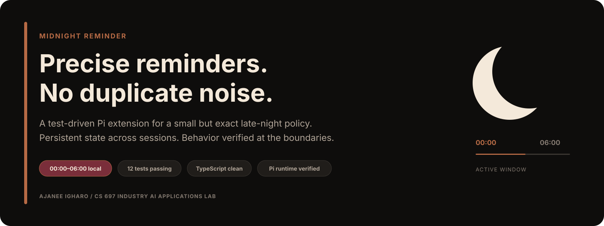
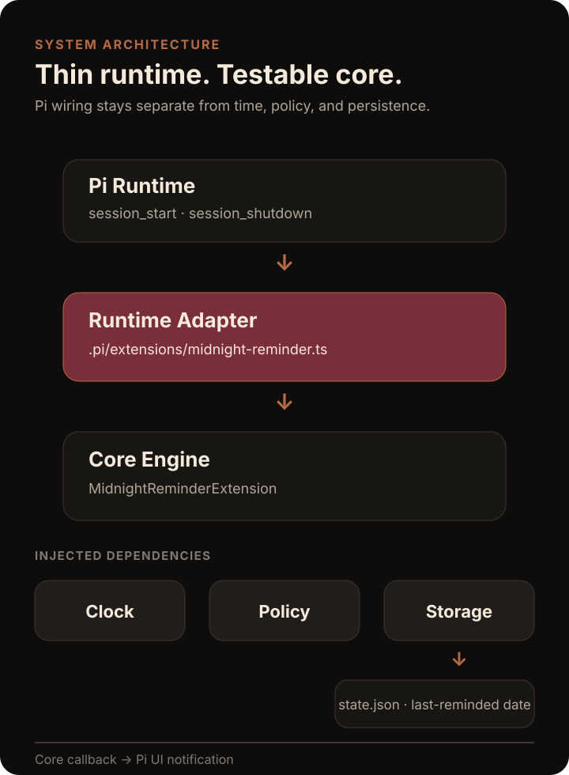
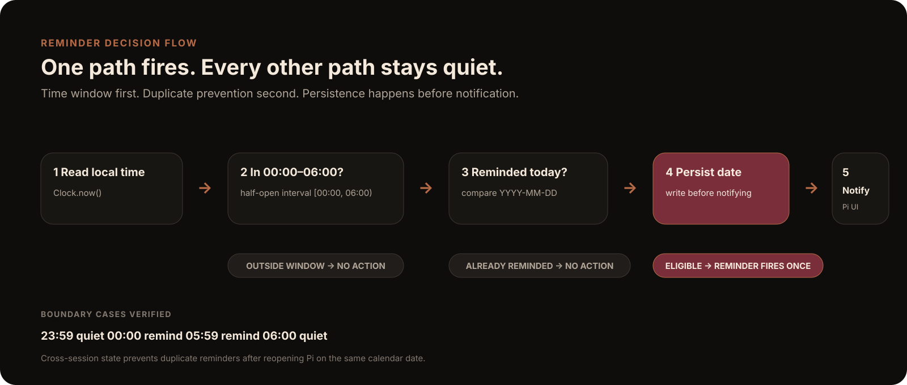

<p align="center">
  
</p>

<p align="center">
  <strong>Precise late-night reminders with persistent duplicate prevention.</strong><br />
  A test-driven Pi extension built for UMass Boston CS 697: Industry AI Applications Lab.
</p>

<p align="center">
  <a href="#overview">Overview</a> ·
  <a href="#architecture">Architecture</a> ·
  <a href="#behavior-contract">Behavior</a> ·
  <a href="#evidence">Evidence</a> ·
  <a href="#demo">Demo</a> ·
  <a href="#run-locally">Run locally</a>
</p>

---

## Overview

Midnight Reminder watches the user's **local time** while Pi is running. During the reminder window `[00:00, 06:00)`, it sends one visible notification per calendar date and persists that date so reopening Pi does not create a duplicate reminder.

This project was developed as a **single-agent coding lab** with explicit requirements, acceptance tests, implementation checkpoints, runtime integration, and a final review pass. The repository preserves that progression in Git history rather than presenting only the finished code.

| Signal | Current state |
| --- | --- |
| Reminder window | `00:00 <= time < 06:00` local |
| Duplicate protection | Persists across Pi sessions |
| Tests | **12 passing** across 4 files |
| Type safety | `tsc --noEmit` clean |
| Runtime | Pi session lifecycle + visible UI callback |
| Demo | Safe command that does not mutate reminder state |

### What I built

- behavioral specification and acceptance criteria
- boundary-focused time policy
- injected `Clock` and `Storage` abstractions
- file-backed cross-session persistence
- Pi runtime adapter and lifecycle cleanup
- safe classroom demo command
- integration, runtime, and duplicate-prevention tests
- review cleanup that removed duplicated date formatting and improved timer hygiene

## Architecture

<p align="center">
  
</p>

The Pi-specific layer stays thin. The core engine receives a clock, storage, and reminder callback, which keeps the time policy independent from the runtime and easy to exercise in tests.

The production storage adapter writes the last-reminded calendar date to `.pi/midnight-reminder-state.json`. Test suites replace real time and persistence with fakes, so boundary behavior can be checked immediately instead of waiting for midnight.

## Behavior contract

<p align="center">
  
</p>

| Scenario | Expected behavior | Why |
| --- | --- | --- |
| `23:59` | No reminder | Outside the active window |
| `00:00` | Reminder | Inclusive lower boundary |
| Already reminded today | No duplicate | Same-date persistence blocks a second notification |
| `05:59` | Reminder | Still inside the active window |
| `06:00` | No reminder | Exclusive upper boundary |

The policy intentionally uses a half-open interval: **`[00:00, 06:00)`**.

## Engineering decisions

**Separate policy from runtime.** `shouldRemind()` has no Pi dependency and no side effects. It only answers whether the current state qualifies for a reminder.

**Inject time and storage.** Tests can control time exactly and reuse storage across simulated sessions.

**Persist before notifying.** The date is stored before the UI callback fires, reducing the chance of duplicate notifications if later work fails.

**Keep the demo safe.** `/midnight-reminder-demo` proves the visible notification path without checking the real clock or changing persisted reminder state.

**Clean up session resources.** The polling interval stops during `session_shutdown`; persisted reminder state remains.

## Evidence

### Verified test result

```text
Test Files  4 passed (4)
Tests       12 passed (12)
TypeScript  No errors
```

### TDD checkpoints preserved in Git

| Stage | Commit | Evidence |
| --- | --- | --- |
| Scaffold | [`665b126`](https://github.com/AjaneeI/midnight-reminder-pi-extension/commit/665b126dcf3086724822f249d576aad868ea1d58) | TypeScript + Vitest project foundation |
| Red | [`daeeab0`](https://github.com/AjaneeI/midnight-reminder-pi-extension/commit/daeeab0f0e591ff13881c455adb6b9a9d59ac7d9) | Failing acceptance tests |
| Green | [`b2d9e50`](https://github.com/AjaneeI/midnight-reminder-pi-extension/commit/b2d9e502417c8d7bf44bd47028851eb7eec996f8) | Time policy implemented |
| Integration | [`ecce189`](https://github.com/AjaneeI/midnight-reminder-pi-extension/commit/ecce189dac7391259f9adfd40d4157e78a22d040) | Pi runtime + persistence + demo |
| Review cleanup | [`fd6bacf`](https://github.com/AjaneeI/midnight-reminder-pi-extension/commit/fd6bacf15650c35e6b3d7105f8e57d56ee081abc) | Deduplicated helper + timer cleanup hygiene |

## Demo

Start Pi from this repository and run:

```text
/midnight-reminder-demo
```

Expected visible notification:

```text
🌙 It's midnight — time for your reminder! (DEMO)
```

The demo command is deliberately separate from the production policy and persistence path.

## Run locally

```bash
npm install
npm test
npm run typecheck
```

Then start Pi from the repository so it can load the project-local extension in `.pi/extensions/`.

## Project map

```text
.
├── .pi/
│   └── extensions/
│       └── midnight-reminder.ts
├── docs/
│   └── assets/
│       ├── architecture.svg
│       ├── decision-flow.svg
│       └── hero.svg
├── src/
│   ├── clock.ts
│   ├── extension.ts
│   ├── pi-storage.ts
│   ├── policy.ts
│   └── storage.ts
├── tests/
│   ├── fakes/
│   ├── duplicate-prevention.test.ts
│   ├── integration.test.ts
│   ├── runtime.test.ts
│   └── time-policy.test.ts
├── SPECIFICATION.md
├── package.json
└── tsconfig.json
```

## Specification

The complete behavioral contract, acceptance criteria, persistence rules, polling behavior, cleanup expectations, and design decisions live in [`SPECIFICATION.md`](SPECIFICATION.md).

<details>
<summary><strong>Coursework provenance</strong></summary>

The functional homework implementation was complete at commit [`fd6bacf`](https://github.com/AjaneeI/midnight-reminder-pi-extension/commit/fd6bacf15650c35e6b3d7105f8e57d56ee081abc). Later commits are presentation and documentation improvements unless explicitly noted otherwise.

</details>
