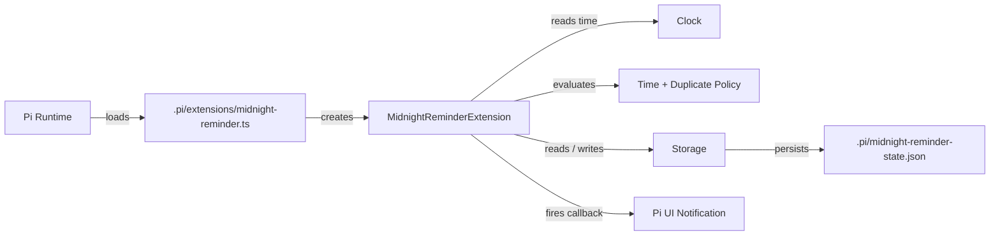
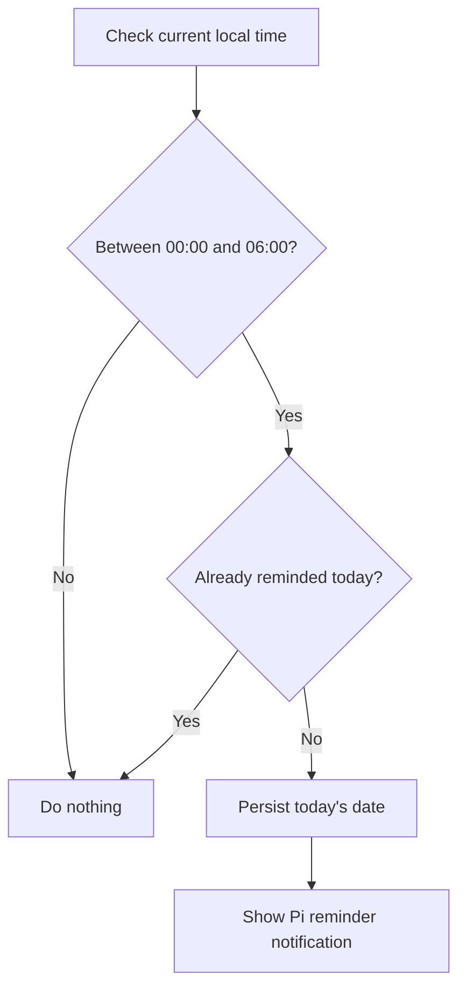
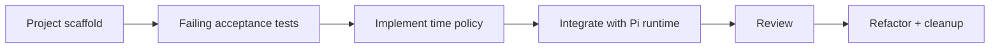

# Midnight Reminder Pi Extension

A test-driven Pi extension that reminds users during late-night hours without sending duplicate reminders.

> **Reminder window:** local time `[00:00, 06:00)`  
> **Current status:** 12 tests passing · TypeScript clean · Pi runtime demo verified

## What it does

The extension evaluates the current local time while Pi is running. If the time is between midnight and 6:00 AM and the user has not already been reminded on that calendar date, it stores the date and displays a visible Pi notification.

### Required behavior

| Scenario | Expected |
|---|---|
| 23:59 | No reminder |
| 00:00 | Reminder |
| Already reminded today | No duplicate |
| 05:59 | Reminder |
| 06:00 | No reminder |

## Architecture



The design keeps the policy independent from the Pi runtime. A `Clock` abstraction makes time controllable in tests, while a `Storage` abstraction allows tests to use in-memory state and the real extension to use file-based persistence.

## Reminder decision flow



## TDD workflow



The Git history preserves this progression, including a dedicated failing-test checkpoint before the production implementation.

## Key engineering decisions

- **Cross-session duplicate prevention:** the last-reminded calendar date is persisted so reopening Pi on the same date does not produce another reminder.
- **Pure policy logic:** `shouldRemind()` has no side effects, making boundary behavior easy to verify.
- **Injected clock and storage:** tests can simulate time and persistence without waiting for real midnight.
- **Safe classroom demo:** `/midnight-reminder-demo` displays the notification without changing real reminder state.
- **Session cleanup:** the polling timer is stopped when the Pi session shuts down, while persisted reminder state remains intact.

## Demo

Start Pi from the repository and run:

```text
/midnight-reminder-demo
```

Expected visible notification:

```text
🌙 It's midnight — time for your reminder! (DEMO)
```

## Testing

```bash
npm test
npm run typecheck
```

Current verified result:

```text
Test Files  4 passed (4)
Tests       12 passed (12)
TypeScript  No errors
```

## Project structure

```text
.
├── .pi/
│   └── extensions/
│       └── midnight-reminder.ts
├── src/
│   ├── clock.ts
│   ├── extension.ts
│   ├── pi-storage.ts
│   ├── policy.ts
│   └── storage.ts
├── tests/
│   ├── fakes/
│   ├── duplicate-prevention.test.ts
│   ├── integration.test.ts
│   ├── runtime.test.ts
│   └── time-policy.test.ts
├── SPECIFICATION.md
├── package.json
└── tsconfig.json
```

## Specification

The behavioral contract, acceptance criteria, and design decisions are documented in [SPECIFICATION.md](SPECIFICATION.md).
